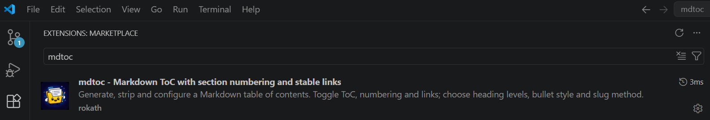

# mdtoc

[](https://github.com/rokath/mdtoc/releases)
[](https://github.com/rokath/mdtoc/commits/main/)
[](https://github.com/rokath/mdtoc/issues)
[](https://makeapullrequest.com)
[](https://github.com/rokath/mdtoc)
[](https://github.com/rokath/mdtoc/releases)
[](https://go.dev/)
[](https://goreportcard.com/report/github.com/rokath/mdtoc)
[](https://coveralls.io/github/rokath/mdtoc?branch=main)
[](https://rokath.github.io/mdtoc/)
[](https://github.com/rokath/mdtoc/actions/workflows/pages.yml)

[View Github Pages](https://rokath.github.io/mdtoc/)

>`mdtoc`: Markdown Table of Contents ☰ with numbering and stable anchor links
>
>**`generate`**, **`strip`** and **`check`** without turning your Markdown into a moving target.


<details markdown="1"> <!-- parse this block as markdown -->
<summary><strong style="font-size: 1.25em;">Table of Contents</strong> <span style="font-size: 0.66em;">(click to expand)</span></summary>

<!-- mdtoc -->

* [1. Features](#1-features)
* [2. Install](#2-install)
  * [2.1. VS Code extension](#21-vs-code-extension)
  * [2.2. Release Binaries (Linux, MacOS, Windows)](#22-release-binaries-linux-macos-windows)
  * [2.3. Darwin Setup](#23-darwin-setup)
  * [2.4. Build from source](#24-build-from-source)
* [3. Usage](#3-usage)
  * [3.1. Inspect the CLI](#31-inspect-the-cli)
  * [3.2. Use .docs/EXAMPLE.md as play ground](#32-use-docsexamplemd-as-play-ground)
* [4. Managed Structure](#4-managed-structure)
* [5. Limits](#5-limits)
* [6. Documentation](#6-documentation)
  * [6.1. Specification](#61-specification)
  * [6.2. Comparison](#62-comparison)
* [7. Status](#7-status)

<!-- numbering=true min=2 max=4 slug=github anchor=false link=true toc=true bullets=auto -->
<!-- /mdtoc -->

</details>

## 1. Features

* **easy** to use: `mdtoc MY.md`, single binary, also as **vsCode** [extension](https://marketplace.visualstudio.com/items?itemName=rokath.mdtoc)
* **configurable**: CLI or edit generated `<!-- numbering=true min=2 max=4 slug=github anchor=true link=true toc=true bullets=auto -->`
  * `on|off` for **numbering**, **anchor**, **link**, **toc**
  * targets ATX headings (**min** `#` to **max** `######`)
  * **slug** profiles: `github`, `gitlab`, `crossnote`
  * auto or explicit (`*`, `-`, `+`) ToC **bullets** style
* **move** the generated ToC with its container to any place - it will be re-generated there
* **protects** non-generated content inside ToC area
  * generated content stays clearly separated from authored content
* works with **files** and Unix **pipes**
* **repeated headings** support
* intentionally **ignores** headings:
  * in **Setext** stype
  * inside **fenced code blocks**
  * inside **HTML comments**: `<!-- ... ## Example -->`
  * between **exclusion regions**: `<!-- mdtoc off -->` ... `<!-- mdtoc on -->`
  * with a **starting space**
* deterministic and idempotent output

## 2. Install

### 2.1. VS Code extension

* Open VS Code, click Extensions, enter `mdtoc`: 

* or CLI install: `code --install-extension rokath.mdtoc`

### 2.2. Release Binaries (Linux, MacOS, Windows)

Download a prebuilt binary from [GitHub Releases](https://github.com/rokath/mdtoc/releases).

### 2.3. Darwin Setup

Homebrew tap install:

```bash
brew install rokath/tap/mdtoc
```

### 2.4. Build from source

```bash
go build ./cmd/mdtoc
```

## 3. Usage

### 3.1. Inspect the CLI

```bash
mdtoc --help        # show compact CLI usage and commands
mdtoc --verbose     # show extended root help with command details
mdtoc <command> -v  # show the long help for one command
```

### 3.2. Use `.docs/EXAMPLE.md` as play ground

```bash
mdtoc EXAMPLE.md                    # new ToC, use config block or defaults, root mode use
mdtoc generate EXAMPLE.md -a off    # new ToC, use CLI or defaults, rewrite the config block
mdtoc check EXAMPLE.md              # fail in CI when ToC differs from the reconstructed ToC
cat EXAMPLE.md | mdtoc              # dry-run
cat EXAMPLE.md | mdtoc strip > s.md # clear via Unix pipe and write to a different file
```

* Exactly one input source is allowed: piped `stdin` or file i/o (with or without `--file/-f`).
* Small CLI note: the Go-style one-dash long form such as `-toc off` is currently tolerated, but `--toc off` remains the documented form.

## 4. Managed Structure

`mdtoc` uses an explicit container so generated content is easy to spot and safe to regenerate.

<details markdown="1">
<summary>(click to expand)</summary>

```md
<!-- mdtoc -->

* [About](#about)

<!-- numbering=true min=2 max=4 slug=github anchor=true link=true toc=true bullets=auto -->
<!-- /mdtoc -->
```

The heading title stays the source of truth. Numbers, inline anchors, and ToC entries are derived from it. With `anchor=false`, the ToC target follows the rendered heading text because no managed inline anchor exists. Use `slug=github|gitlab|crossnote` to control the link type generation.

The optional config block records the settings used for regeneration. `generate` uses current CLI flags or defaults and then rewrites that block when settings need to be persisted.

This means:

* the stored config is persisted generator input
* `check` validates against regenerated output
* changing generation can go through generate, or manual config edits

</details>

## 5. Limits

* repeated-heading links depend on occurrence order ([#8](https://github.com/rokath/mdtoc/issues/8))
  * Workaround: [example](./docs/EXAMPLE.md#chapter-a-about)
* The `check` command does not detect duplicate link anchors. See [#97](https://github.com/rokath/mdtoc/issues/97).
* The per default with `anchor=true` generated ToC links guaranty to work in any environment, but reduce the readability of the raw Markdown document. With `anchor=off numbering=off slug=crossnote` a good working setting is possible. But switching `numbering=on` breaks the link stability promise then. There is no generally best setting - you have to choose. See also [#94](https://github.com/rokath/mdtoc/issues/94).
* not a site generator
* not a Markdown formatter

## 6. Documentation

### 6.1. Specification

* [mdtoc spec](./docs/spec.md)

### 6.2. Comparison

* [mdtoc alternatives](./docs/alternatives.md)
* [mdtoc VS Code extension MVP](./docs/vscode-extension-mvp.md)

## 7. Status

```diff
+ READY TO USE +
```
