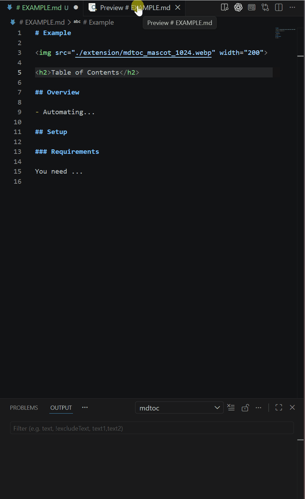

# mdtoc VS Code Extension

> `mdtoc` - generate and strip Markdown tables of contents
> ☰ with numbering and stable anchor links (configurable)


The extension is a thin VS Code adapter around the `mdtoc` CLI (usable in CI)
and updates the active Markdown document in place.

The canonical project repository is https://github.com/rokath/mdtoc.

## Features

This extension brings the core `mdtoc` workflow into VS Code:

* generate or refresh a managed table of contents in the active Markdown file
* strip a managed table of contents again
* keep generated content separate from authored content
* reuse existing managed container settings when a document already contains a valid `mdtoc` block
* use stable ToC link targets derived from managed heading output
* support repeated headings
* ignore headings inside fenced code blocks safely
* support exclusion regions with `<!-- mdtoc off -->` and `<!-- mdtoc on -->`
* work with the same canonical `mdtoc` binary as the CLI
* keep the VS Code workflow aligned with the same `mdtoc` binary you can also run directly in local scripts and CI

## Commands Available in VS Code

* `mdtoc: Generate ToC`
* `mdtoc: Strip ToC`

`Generate ToC` runs `mdtoc` in root mode:

* if the document has no managed container yet, `mdtoc` creates one with its default settings (generate)
* if the document already has a valid managed container, `mdtoc` renews it from the stored container config
* you can edit the `mdtoc` config block values directly to match your needs
* if the managed container is invalid, the document stays unchanged and the CLI error is shown
* if a managed container is broken, beyond repair, you can delete it and run `mdtoc: Generate ToC` again to create a fresh one

`Strip ToC` runs the explicit `strip` subcommand. If the CLI reports an error, the document also stays unchanged.

## How to Use

Open a Markdown file in VS Code, then use one of these entry points:

* Command Palette: `Shift+Cmd+P` on macOS or `Ctrl+Shift+P` on Windows/Linux, then run `mdtoc: Generate ToC` or `mdtoc: Strip ToC`
* Editor context menu: right-click inside an open Markdown editor and choose `mdtoc: Generate ToC` or `mdtoc: Strip ToC`

The table of contents is initially created at the beginning of the document. You can then move the managed block to another place in the file and `mdtoc: Generate ToC` will update it there.



## Installation

Install the extension from a packaged `.vsix` file:

1. Download the `.vsix` that matches your platform.
2. In VS Code, run `Extensions: Install from VSIX...`.
3. Select the downloaded `.vsix` file.

The extension is intended for the VS Code Marketplace as the editor integration of the `rokath/mdtoc` repository.

## Configuration

The extension supports one runtime setting:

```json
{
  "mdtoc.executable.customPath": ""
}
```

If `mdtoc.executable.customPath` is set, the extension uses that absolute path. Otherwise it uses the bundled platform binary.

There is no automatic `PATH` lookup in the current extension.

## More Information

The underlying `mdtoc` binary is not limited to VS Code. You can use it directly in shell workflows, scripts, and CI, for example with `mdtoc check README.md` to fail a pipeline when a managed Markdown file is out of date.

For CLI usage and the full feature set, see the repository README:

https://github.com/rokath/mdtoc/blob/main/README.md

Developer-focused notes about local testing, packaging, binary staging, and release preparation live here:

https://github.com/rokath/mdtoc/blob/main/extension/DEVELOPMENT.md
